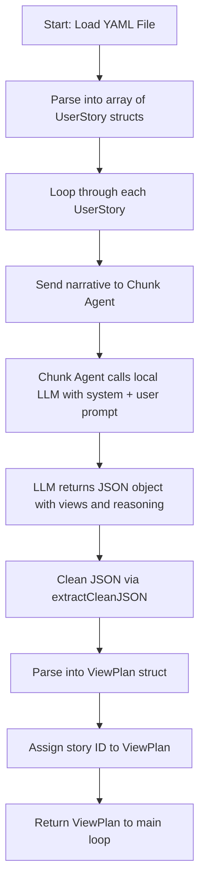
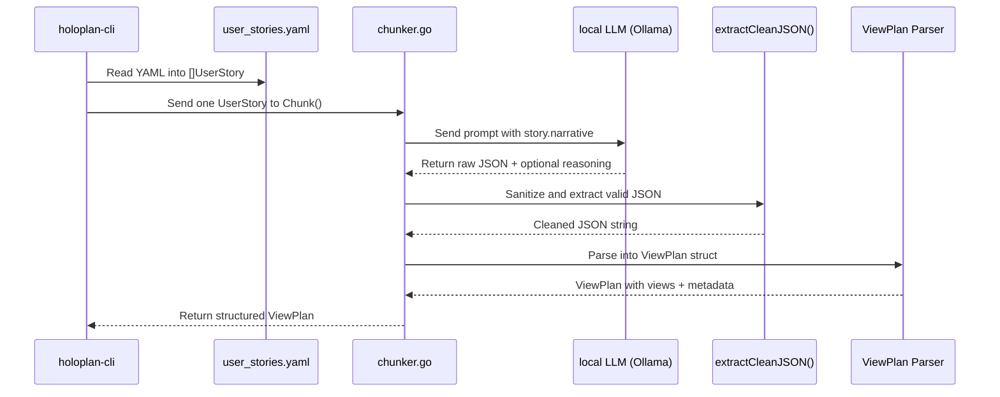

# How User Stories Are Chunked

This document describes how Holoplan processes user stories and transforms them into structured UI view plans using a dedicated LLM agent (`chunker.go`).

---

## 📘 Overview

Holoplan reads user stories from a YAML file and feeds them, one at a time, into a local LLM via the `Chunk()` agent. The LLM returns a structured JSON payload describing the UI views required to satisfy the story. Each view includes its name, type, and components.

---

## 🔄 Chunking Pipeline



# Chunk Agent Interaction: Sequence Diagram

This diagram shows the step-by-step sequence of how the Holoplan system interacts with the `Chunk` agent and the local LLM to transform a user story into structured views.


---

## 🔍 Example

**Input YAML:**

```yaml
- id: "US-101"
  title: "Browse Indoor Plants"
  narrative: |
    As a plant enthusiast,
    I want to browse a list of indoor plants,
    so that I can choose one that suits my home environment.
```

**LLM Prompt:**

```text
User story:
As a plant enthusiast,
I want to browse a list of indoor plants,
so that I can choose one that suits my home environment.
```

**Expected JSON Response:**

```json
{
  "views": [
    {
      "name": "Plant Gallery",
      "type": "GridView",
      "components": ["Plant Image", "Plant Name", "Lighting Icon", "Add to Favorites"]
    }
  ],
  "reasoning": "The story is about browsing a list of plants, so a grid-based gallery with key details is appropriate."
}
```

---

## 🧠 Agent Logic Summary

* Uses temperature 0 and deterministic seed
* Extracts raw JSON from noisy LLM outputs using `extractCleanJSON()`
* Escapes embedded newlines and trims `<think>` tags
* Logs view extraction and errors for traceability

---


